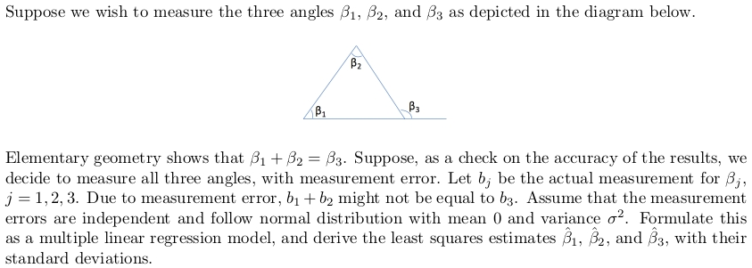

```{r include = FALSE}
knitr::opts_chunk$set(
  warning = FALSE,       # don't show warnings
  message = FALSE,       # don't show messages (less serious warnings)
  cache = TRUE,         # set to TRUE to save results from last compilation
  fig.align = "center"   # center figures
)

library(tidyverse)       # load libraries you always use here
library(knitr)           # require for purl function to create code appendix
library(ggplot2)         # for plotting
library(GGally)          # needed for scatter plot matrix
#library(car)             # Required for levene's test
#library(coin)            # Required for randomization test
#library(CarletonStats)   # Required for permTestPaired
#library(tidymodels)
#library(mvtnorm)         #Required for bivariate normal distribution

set.seed(1104)             # make random results reproducible
```

# Motivation
```{r, echo = FALSE}

```

```{r}
b1 = c()
b2 = c()
b3 = c()
for (i in seq(1,100)){
  b1 = append(b1, 60 + rnorm(1))
  b2 = append(b2, 60 + rnorm(1))
  b3 = append(b3, 120 + rnorm(1))
}

trilm = lm(b3 ~ b1 + b2)
summary(trilm)
```